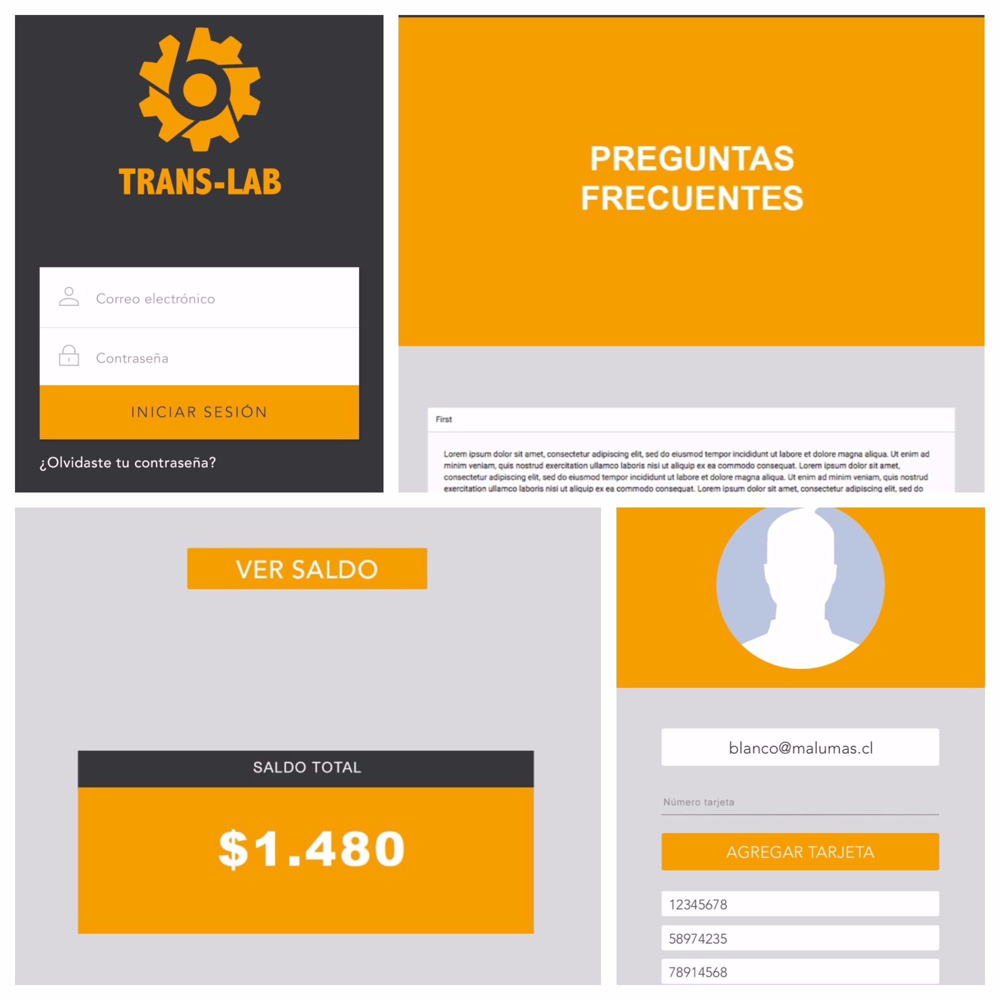
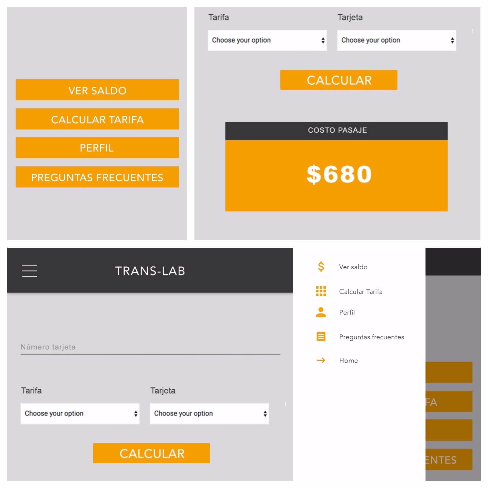

# trans-lab
Proyecto TransLab

- Creación de una aplicación web para consultar saldo en Bip!
*Analizar la documentación en http://bip-servicio.herokuapp.com*
- El diseño es mobile first, no tiene versión Desktop
*Condiciones:*
- INICIO: Se debe corroborar que el mail tenga un formato válido, la contraseña debe tener máximo 8 caracteres y aceptar solo números, al validar correctamente los campos debe pasar a la siguente pantalla. PUNTOS EXTRA: Hacer uso de local-storage
- PANTALLA 2: Al ingresar correctamente se debe mostrar una pantalla con las opciones de la app, la hamburguesa que se muestra a la izquierda debe desplegar un menú con opciones. Al desplegarse el menú se muestran todas las opciones que tenemos disponibles a nuestra app. El link HOME nos lleva a la pantalla con las opciones. El menú debe estar disponible en todas las pantallas una vez que se ha ingresado a la app.
- PANTALLA 3: La pantalla de perfil debe mostrar una imaen por defecto del usuario. Debe mostrar el mail que el usuario ingresó. Debe tener un input y un botón de agregar donde podemos agregar números de tarjetas para consulta posterior. Las tarjetas agregadas deben mostrarse. PUNTOS EXTRA: Mostrar e-mail de usuario con localstorage, guardar tarjetas con local storage.
- PANTALLA 4: Las preguntas frecuentes debe mostrar un desplegable que muestre las preguntas y al hacer clic, muestre la respuesta a la pregunta correspondiente. El contenido es de libre diseño.
- PANTALLA 5: La pantalla ver saldo debe constar de un input donde podemos ingresar el número de nuestra tarjeta y un select, donde se muestran los números de todas las tarjetas guardadas. Al dar clic al botón VER SALDO, nos debe mostrar el saldo de nuestra tarjeta. Si seleccionas una tarjeta del select, el input debe bloquearse.
- La pantalla de CALCULAR TARIFA debe mostrar un select con las opciones de horarios de viaje. Según el horario, se debe descontar el costo del pasaje al saldo de nuestra tarjeta. Al dar click al botón CALCULAR, se debe mostrar el costo del pasaje y el saldo de la tarjeta con el costo del pasaje ya descontado.

